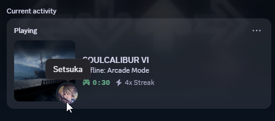

# CaliburDiscord

CaliburDiscord is a Lua-based plugin that adds Discord Rich Presence integration into SOULCALIBUR VI, allowing your current in-game activity to be displayed directly on your Discord profile.

## Features

- Displays current battle mode (Training, Local Versus, Story, Libra, etc.)
- Shows Character and Stage information dynamically based on the chosen side.
- Supports the detection of Local Versus, CPU Battles, Replays and even Mock Battles

## Requirements

- UE4SS (Universal Unreal Engine 4 Script System)

You must download the latest experimental-latest build [here](https://github.com/UE4SS-RE/RE-UE4SS/tree/experimental-latest).

## Installation

- Download and install [UE4SS (experimental-latest)](https://github.com/UE4SS-RE/RE-UE4SS/tree/experimental-latest).
- Place the CaliburDiscord plugin folder into your `SoulcaliburVI\Binaries\Win64\ue4ss\Mods\CaliburDiscord` directory (needs to be inside of a CaliburDiscord folder)
- Launch the game: Discord Rich Presence will initialise automatically when a battle starts.

You should now see SOULCALIBUR VI activity on your Discord profile!

## Notes

- This plugin is purely cosmetic and does not modify gameplay.
- Requires Discord to be running in the background for presence updates to work.
- Compatible with most versions of SOULCALIBUR VI on PC.

If you’d like to extend or debug this plugin:
Check the Lua scripts inside Mods/CaliburDiscord/Scripts/.
The core logic resides in `main.lua` and supporting modules like `calibur.lua`

## Additional Credits
- [UE4SS Team](https://github.com/UE4SS-RE/RE-UE4SS/releases/tag/experimental-latest): For providing Lua scripting functionality for their application.
- [GhostyPool](https://github.com/GhostyPool/DiscordRPC-Lua): For allowing an easy library for Integrated Discord Rich Presence via Lua.

## License

- This project is licensed under the MIT License.
- SOULCALIBUR VI and all related assets are the property of Bandai Namco Entertainment.
- This project is an independent, non-commercial fan-made integration.
